<div align="center">

# MizanNet

**Maden ve inşaat sektörü için masaüstü işletme yönetim uygulaması**

[](https://tauri.app)
[](https://nextjs.org)
[](https://react.dev)
[](https://typescriptlang.org)
[](https://rustlang.org)
[](https://sqlite.org)


**[Özellikler](#-özellikler--modüller) • [Ekran Görüntüleri](#-ekran-görüntüleri) • [Kurulum](#-kurulum-ve-çalıştırma) • [Proje Yapısı](#-proje-yapısı) • [Teknoloji](#-teknoloji-yığını)**

</div>

---

## 📌 Proje Hakkında

**MizanNet**, maden ocakları ve inşaat firmalarının günlük operasyonlarını — cari hesaplardan stok takibine, araç filosundan personel yönetimine — tek bir masaüstü uygulamadan yönetebilmesi için geliştirilmiş, tamamen **Türkçe arayüzlü** bir işletme yönetim sistemidir.

- 🔒 **Verileriniz sizde kalır:** Tüm veriler yerel **SQLite** veritabanında saklanır
- 📴 **Çevrimdışı çalışır:** İnternet bağlantısı olmadan tüm modüller kullanılabilir
- 🏭 **Sektöre özel:** Hafriyat, maden ve inşaat firmalarının iş akışlarına göre tasarlandı
- 🏢 **Çoklu işletme & şube:** Birden fazla işletme ve şube yönetimi

## ✨ Özellikler / Modüller

| Modül | Açıklama |
|---|---|
| 📊 **Yönetim Paneli** | Finansal genel bakış: bakiye, kâr, gelir/gider grafikleri ve son işlemler |
| 💼 **Cari Hesaplar** | Müşteri/tedarikçi cari takibi, bakiye ve hareket geçmişi, Excel aktarımı |
| 🧾 **e-Fatura (GİB)** | GİB e-Arşiv portalı entegrasyonu, kontör olmadan fatura kesme ve imzalama |
| 📦 **Depo** | Stok ve malzeme takibi, stok hareketleri, kritik stok uyarıları |
| 🚛 **Araçlar** | Araç filosu, bakım, lastik ve masraf takibi |
| 🏛️ **Vergi Takibi** | Vergi/SGK ödemeleri ve son tarih takibi, KDV hesaplayıcı |
| 👷 **İşçiler** | Personel kayıtları, izin, mesai, avans ve maaş bordrosu |
| 📄 **Belge Arşivi** | Şirket belgelerinin dijital arşivi ve kategorize edilmiş saklama |
| 🔔 **Bildirimler** | Önemli hatırlatma ve uyarı bildirimleri |
| 📅 **Takvim** | Ödeme günleri ve önemli tarihler için takvim görünümü |
| 📊 **Veri Aktarımı** | Excel içe/dışa aktarma ve fatura verisi işleme |
| 🤖 **Yapay Zeka Asistanı** | Yerel veya bulut tabanlı akıllı asistan; faturaları tanır, rapor çıkarır |
| 💬 **Haberleşme** | WhatsApp ve Telegram entegrasyonları ile onay akışları |
| 📚 **Bilgi Bankası** | İş hukuku, VUK ve tebliğler içeren yerleşik rehber |
| ♻️ **Geri Dönüşüm Kutusu** | Silinen kayıtları geri yükleme ve kalıcı silme |
| ⚙️ **Ayarlar** | Profil, yedekleme, AI sağlayıcı, lisans ve veri konumu yönetimi |
| 🔐 **Lisans Sistemi** | Çevrimdışı çalışan, donanım bağımsız VIP lisans doğrulama |

## 🖼️ Ekran Görüntüleri

<div align="center">

### Yönetim Paneli
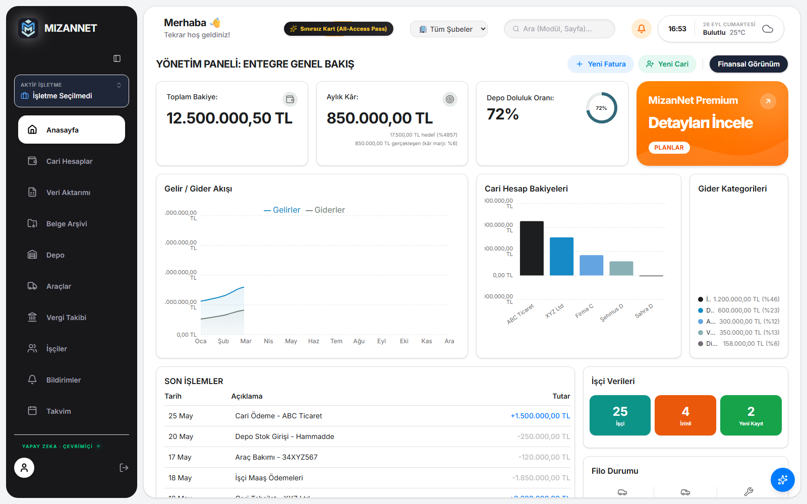

### Cari Hesaplar
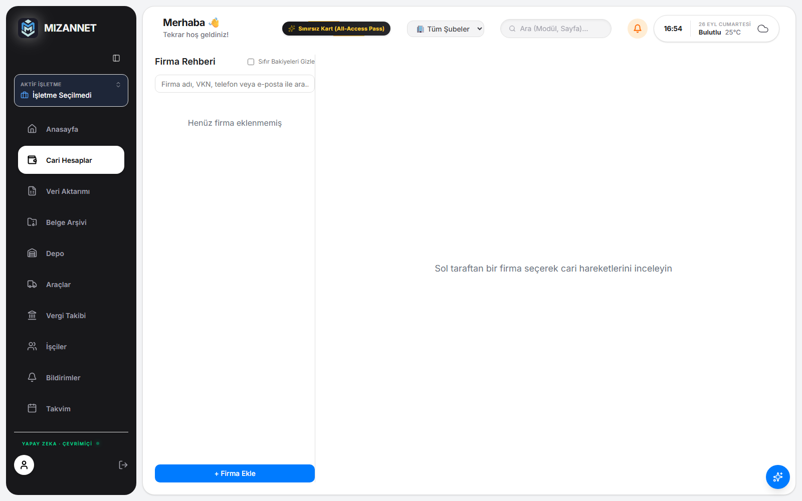

</div>

<details>
<summary><b>📂 Diğer Modüller</b></summary>

<div align="center">

| | |
|---|---|
| 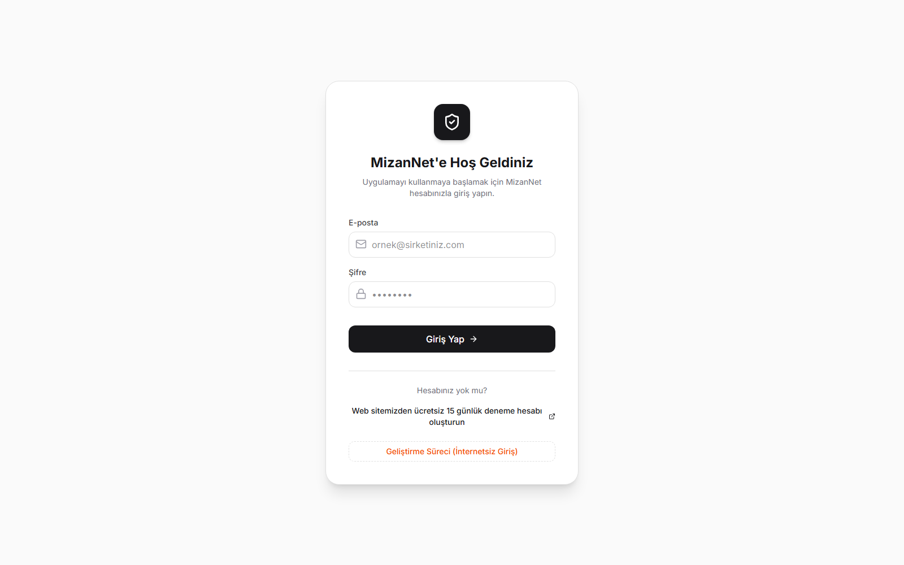 | 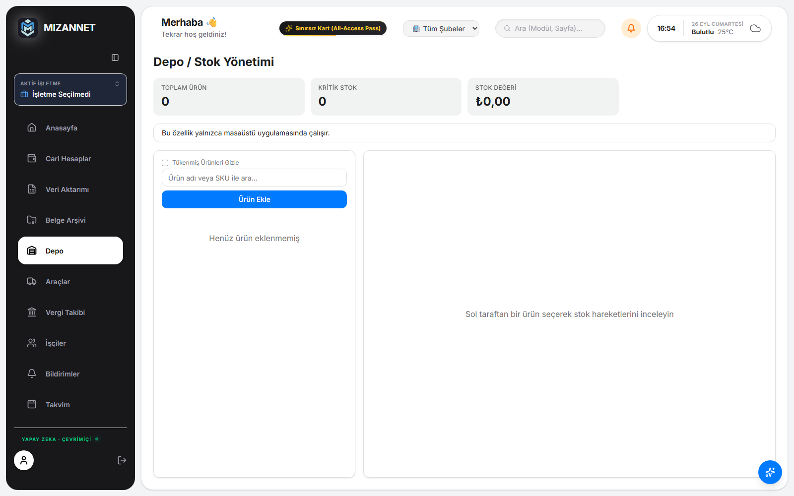 |
| **Giriş Ekranı** | **Depo / Stok** |
| 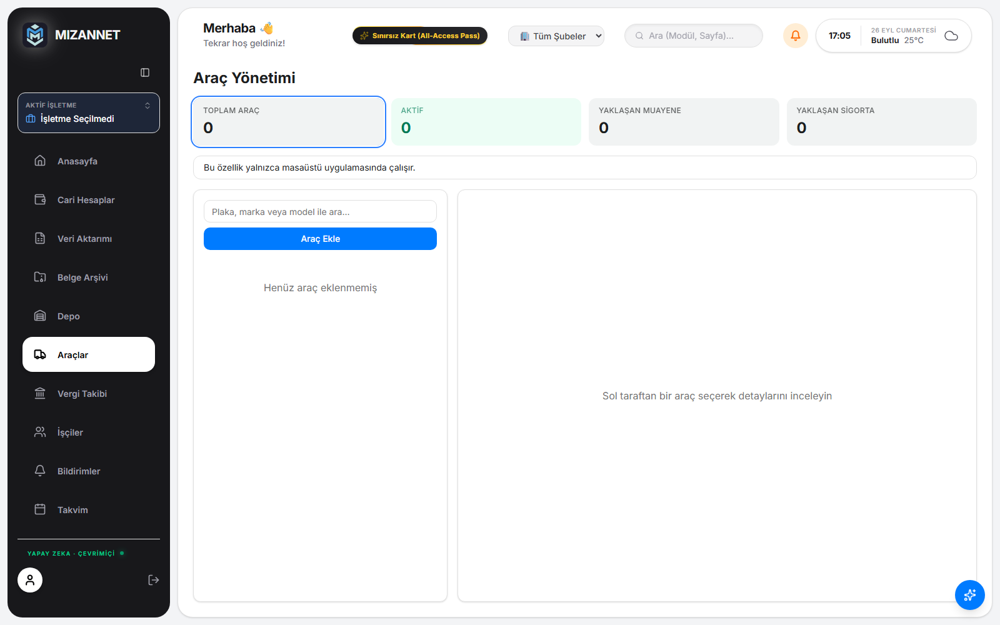 | 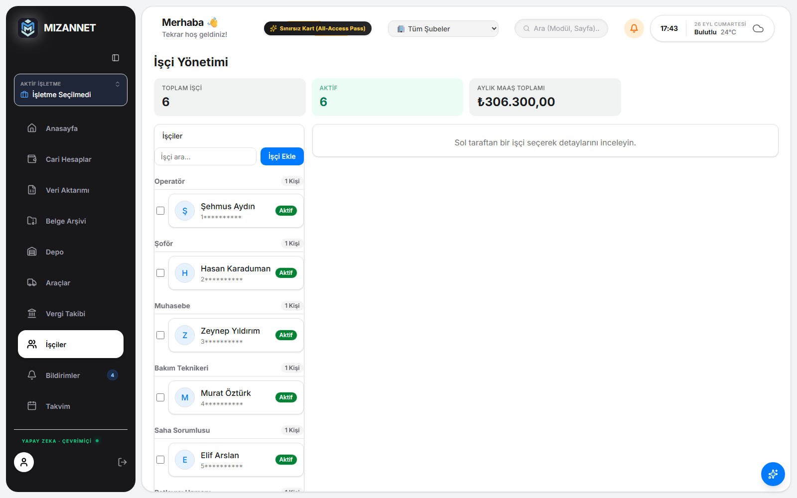 |
| **Araç Filosu** | **İşçi Yönetimi** |
| 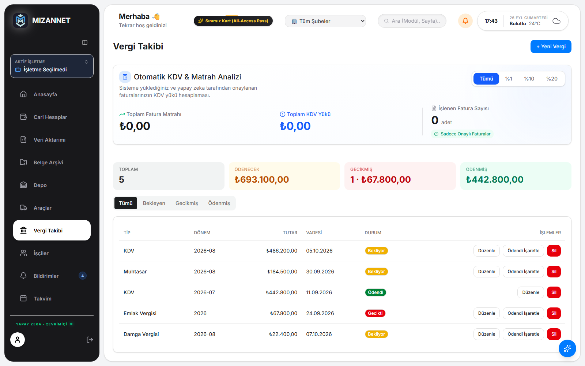 | 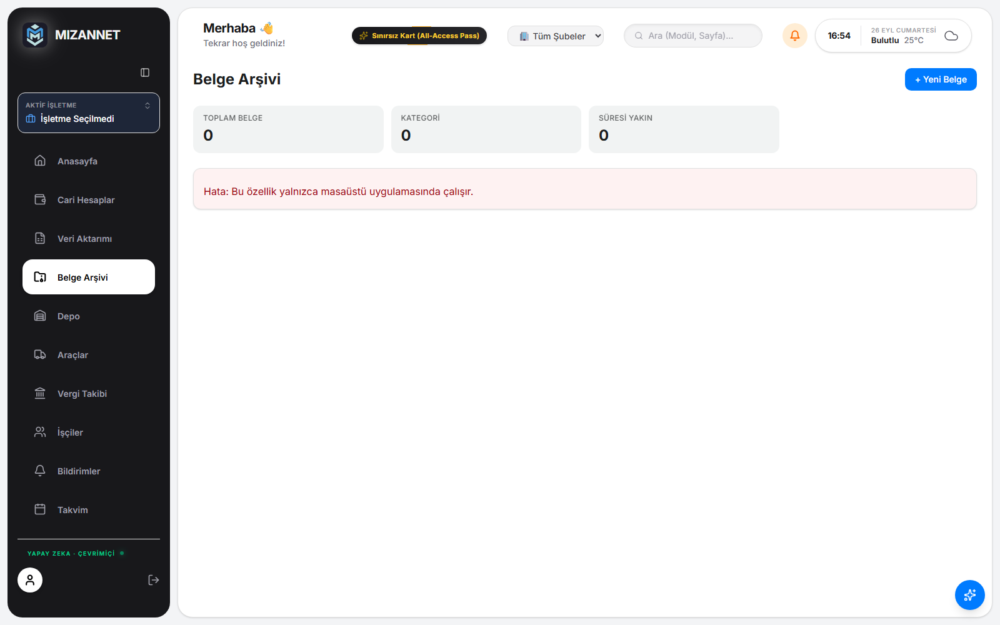 |
| **Vergi Takibi** | **Belge Arşivi** |
| 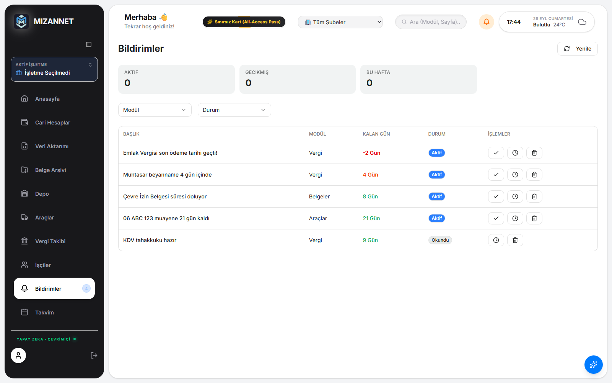 | 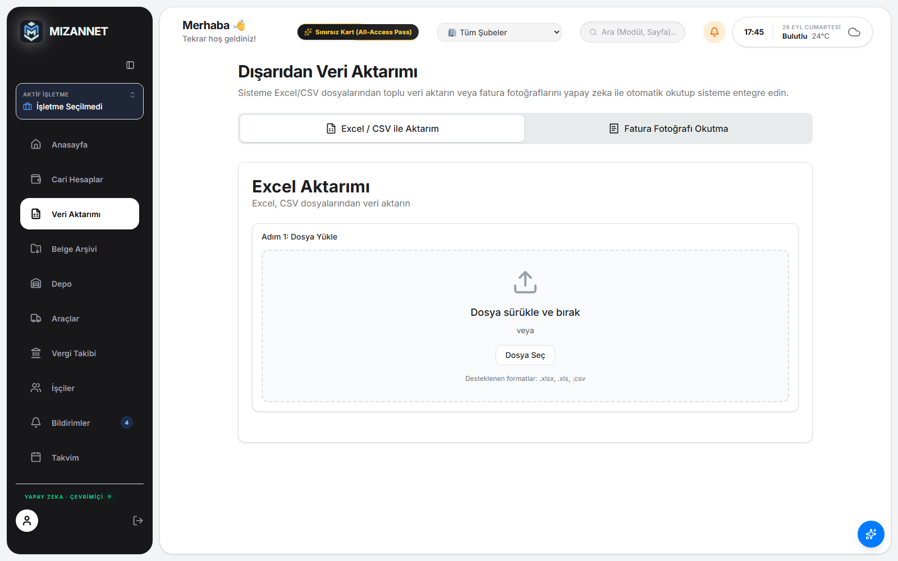 |
| **Bildirimler** | **Veri Aktarımı** |
| 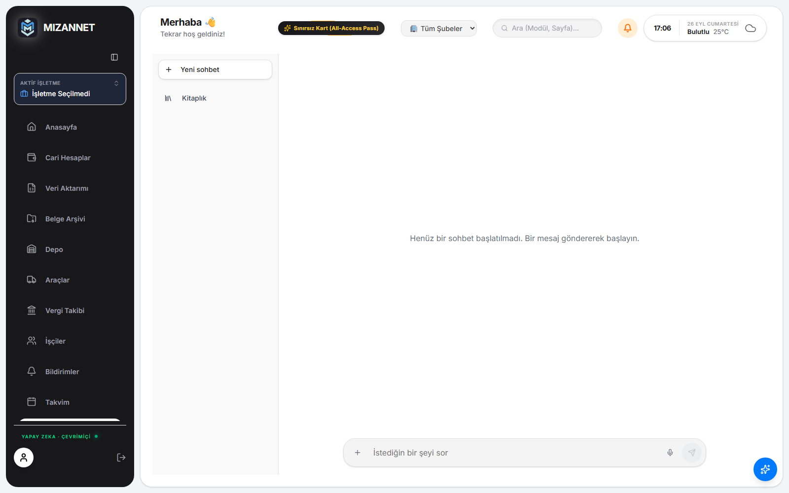 | 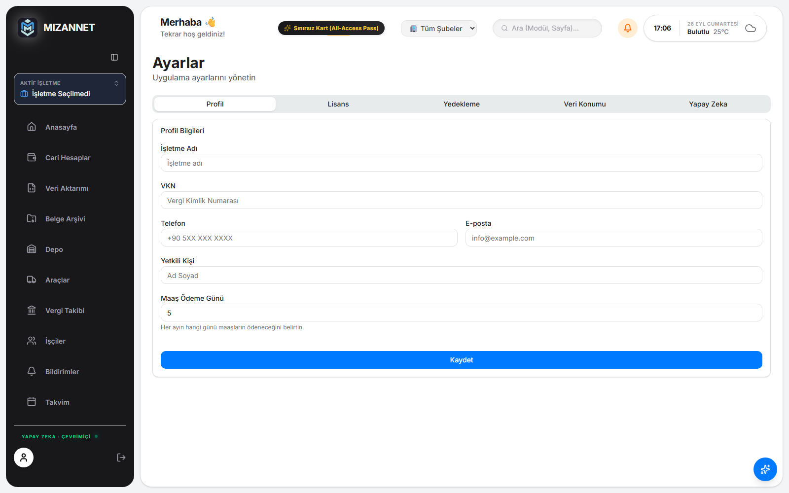 |
| **Yapay Zeka Asistanı** | **Ayarlar** |
| 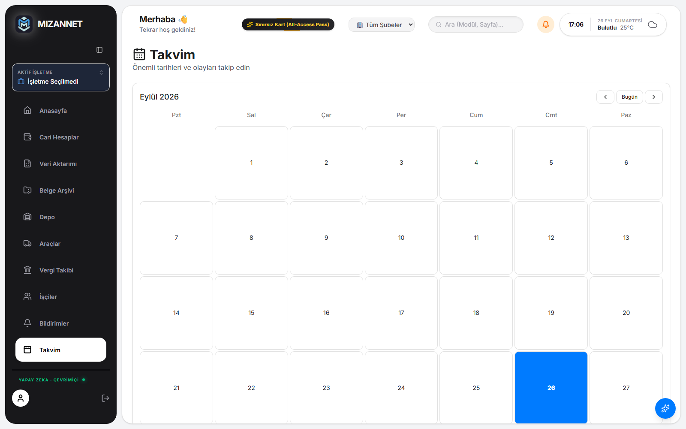 | 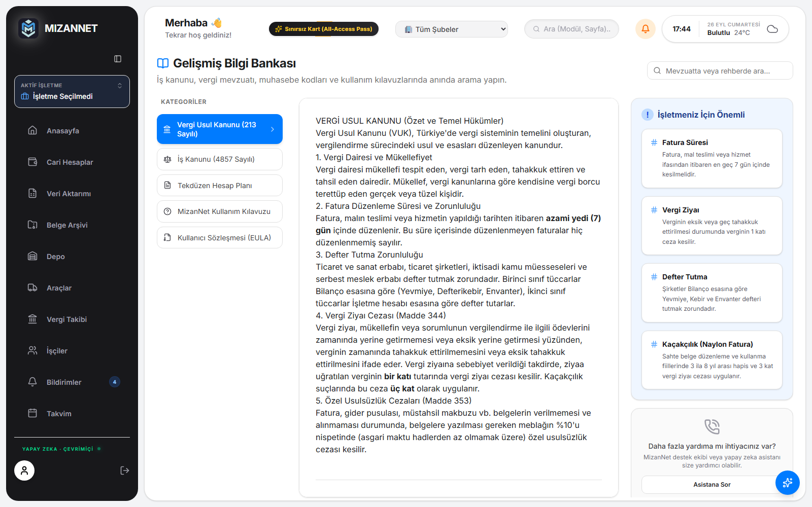 |
| **Takvim** | **Bilgi Bankası** |

</div>
</details>

## 🛠️ Teknoloji Yığını

| Katman | Teknoloji |
|---|---|
| Masaüstü çatısı | **Tauri 2** (Rust) |
| Arayüz | **Next.js 15** + **React 19** + **TypeScript** |
| Veritabanı | **SQLite** (yerel, çevrimdışı) |
| Grafikler | Recharts |
| Stil | Tailwind CSS |
| Paket yöneticisi | pnpm |

**Rust backend modülleri:** SQLite veri katmanı (`db.rs`), şifreleme (`crypto.rs`), lisans doğrulama (`license.rs`), yerel AI motoru (`ai.rs`), Excel/fatura işleme, yedekleme ve WhatsApp/Telegram entegrasyonları.

## 🚀 Kurulum ve Çalıştırma

> **Ön koşul:** [Node.js 18+](https://nodejs.org), [pnpm](https://pnpm.io) ve [Rust](https://rustup.rs). Ayrıntılı liste için [Tauri kurulum kılavuzu](https://tauri.app/start/prerequisites/)'na bakın.

```bash
# Bağımlılıkları yükle
pnpm install

# Geliştirme modunda çalıştır (Tauri masaüstü penceresi açılır)
pnpm tauri dev

# Üretim için derle (installer/exe çıktısı src-tauri/target altına iner)
pnpm tauri build
```

> WhatsApp worker'ı (isteğe bağlı): `cd whatsapp-worker && npm install`

## 📁 Proje Yapısı

```
mizannet/
├── src/                    # Next.js / React frontend
│   ├── app/                # Modül sayfaları (cari, depo, araclar, vergi, ...)
│   ├── components/         # UI bileşenleri (modül bazlı organize)
│   ├── contexts/           # Auth ve şube (branch) context'leri
│   ├── hooks/              # Backend çağrılarını yöneten hook'lar
│   └── lib/                # Tauri köprüsü, Excel, yardımcılar
├── src-tauri/              # Rust backend (Tauri 2)
│   ├── src/commands/       # Tauri komutları (modül bazlı)
│   ├── src/db.rs           # SQLite veri katmanı
│   ├── src/ai.rs           # Yerel/bulut AI motoru
│   ├── src/license.rs      # Çevrimdışı lisans doğrulama
│   └── icons/              # Uygulama ikonları
├── whatsapp-worker/        # WhatsApp entegrasyon servisi (Baileys)
├── brand/                  # Marka varlıkları (logo, renkler)
└── docs/screenshots/       # README görselleri
```

## 🗺️ Yol Haritası

- [x] Uygulama içi ekran görüntüleri
- [x] WhatsApp & Telegram entegrasyonları
- [x] Yerel AI motoru (çevrimdışı asistan)
- [ ] Raporlama ve gelişmiş grafik modülü
- [ ] Otomatik güncelleme mekanizması
- [ ] macOS & Linux derlemeleri

---

<div align="center">

Geliştirici: **[karaturancan-droid](https://github.com/karaturancan-droid)**

© 2026 Madenova — MizanNet

</div>
